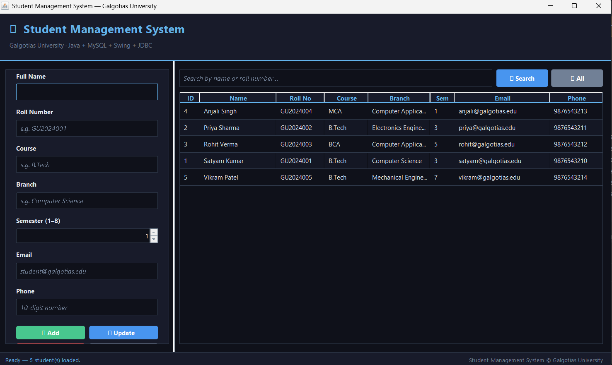

# 🎓 Student Management System

**Associated with:** Galgotias University   
**URL:** https://github.com/Satyam0079/StudentManagementSystem  
**Tech Stack:** Java · MySQL · Swing · JDBC · OOP

A desktop CRUD application to manage student records, built with Java and MySQL.

---

## ✨ Features

- Full **Create, Read, Update, Delete** functionality
- **Swing GUI** for intuitive interaction
- **MySQL** persistence layer with normalized schema design
- **Parameterized queries** to prevent SQL injection and ensure data integrity
- **Search** students by name or roll number instantly
- **Dark themed** polished UI with alternating rows and status bar

---

## 🖥️ Screenshots

> App running with 5 students loaded from MySQL database
> 


---


## 🗂️ Project Structure
StudentManagementSystem/
├── lib/
│   └── mysql-connector-j-9.7.0.jar
├── src/
│   ├── dao/
│   │   ├── StudentDAO.java        ← Interface (abstraction layer)
│   │   └── StudentDAOImpl.java    ← MySQL implementation
│   ├── db/
│   │   └── DatabaseConnection.java ← Singleton JDBC connection
│   ├── model/
│   │   └── Student.java           ← Entity / POJO
│   └── ui/
│       └── MainFrame.java         ← Swing GUI (entry point)
├── schema.sql                     ← Database schema + sample data
└── README.md

---

## ⚙️ Setup Instructions

### Prerequisites
| Tool | Version |
|------|---------|
| Java JDK | 17 or higher |
| MySQL Server | 8.0+ |
| MySQL Connector/J | 9.7.0 |
| IDE | IntelliJ IDEA |

### Step 1 — Create the Database
Open MySQL and run:
```sql
source schema.sql;
```

### Step 2 — Configure DB Connection
Edit `src/db/DatabaseConnection.java`:
```java
private static final String DB_USER     = "root";
private static final String DB_PASSWORD = "your_password";
```

### Step 3 — Add JDBC Driver
- Add `mysql-connector-j-9.7.0.jar` from the `lib/` folder
- In IntelliJ: `File → Project Structure → Modules → Dependencies → + → JARs`

### Step 4 — Run
Open `src/ui/MainFrame.java` → right-click → **Run 'MainFrame.main()'**

---

## 🖥️ How to Use

| Action | Steps |
|--------|-------|
| **Add Student** | Fill the form on the left → click ➕ Add |
| **View All** | Students load automatically on startup |
| **Search** | Type name or roll number → click 🔍 Search |
| **Update** | Click a row (form fills up) → edit → click ✏️ Update |
| **Delete** | Click a row → click 🗑 Delete → confirm Yes |
| **Clear Form** | Click ✖ Clear |

---

## 🗄️ Database Schema

```sql
CREATE TABLE students (
    id         INT AUTO_INCREMENT PRIMARY KEY,
    name       VARCHAR(100) NOT NULL,
    roll_no    VARCHAR(20)  NOT NULL UNIQUE,
    course     VARCHAR(100) NOT NULL,
    branch     VARCHAR(100) NOT NULL,
    semester   INT NOT NULL CHECK (semester BETWEEN 1 AND 8),
    email      VARCHAR(150) NOT NULL UNIQUE,
    phone      VARCHAR(15),
    created_at TIMESTAMP DEFAULT CURRENT_TIMESTAMP,
    updated_at TIMESTAMP DEFAULT CURRENT_TIMESTAMP ON UPDATE CURRENT_TIMESTAMP
);
```

---

## 🔐 SQL Injection Prevention

All queries use **PreparedStatement** with `?` placeholders:

```java
// ✅ Safe — parameterized query
PreparedStatement ps = conn.prepareStatement(
    "SELECT * FROM students WHERE name LIKE ?"
);
ps.setString(1, "%" + keyword + "%");

// ❌ Unsafe (NOT used in this project)
// "SELECT * FROM students WHERE name = '" + input + "'"
```

---

## 🧠 OOP Design Principles

| Principle | Implementation |
|-----------|---------------|
| **Encapsulation** | `Student.java` — private fields with getters/setters |
| **Abstraction** | `StudentDAO` interface separates contract from implementation |
| **Single Responsibility** | Separate classes for Model, DB, DAO, and UI |
| **Singleton Pattern** | `DatabaseConnection` — one shared connection instance |
| **Dependency Inversion** | UI depends on `StudentDAO` interface, not `StudentDAOImpl` |

---

## 🛠️ Skills Demonstrated

`Java` `MySQL` `Swing` `JDBC` `OOP` `Design Patterns` `SQL` `GUI Development`

---

*Built as a portfolio project for Galgotias University*
Press Ctrl + S to save!

Then in the IntelliJ Terminal run:
cmd git add README.md
git commit -m "Add README"
git push
